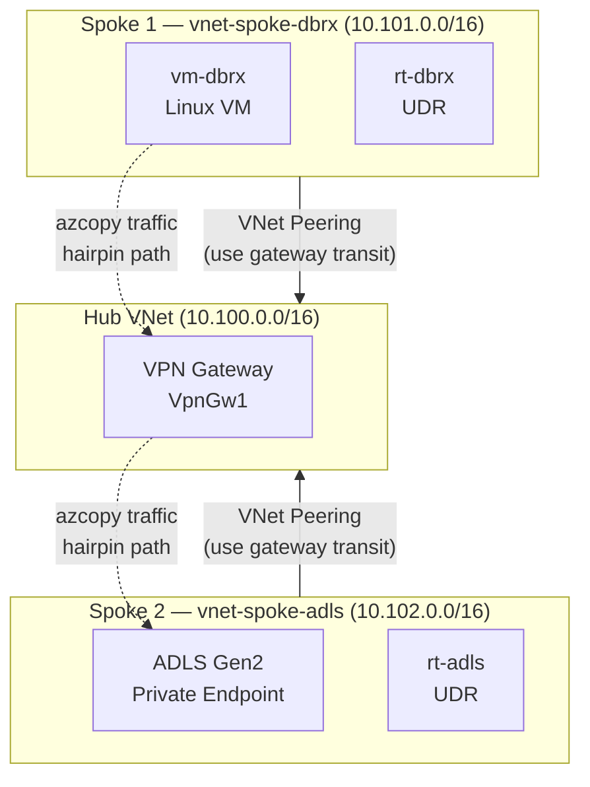

# Spoke-to-Spoke Lab

Azure hub-and-spoke lab that demonstrates spoke-to-spoke traffic hairpinning through a VPN gateway, with validated fixes.

> **Gateway type**: This lab uses a VPN gateway, but the same hairpin behavior occurs with **ExpressRoute gateways**. Both support `allowGatewayTransit` / `useRemoteGateways` and both will process spoke-to-spoke traffic when a catch-all UDR forces `0.0.0.0/0 → VirtualNetworkGateway`. The fixes demonstrated here apply equally to ExpressRoute environments.

## Key Findings

Full validation report with Grafana screenshots, effective routes, and metric comparisons: **[REPORT.md](REPORT.md)**

| Configuration | Gateway Flows (Max) | Gateway in data path? | Changes required |
|--------------|--------------------|-----------------------|-----------------|
| **Broken** (catch-all UDR) | **3,120** | Yes — all traffic | — |
| **Fix 1: Direct Peering** | 600 (baseline) | **No** | UDR removed, gateway transit disabled, spoke-to-spoke peering added |
| **Fix 2: Adjacent PE** ⭐ | 637 (flat) | **No** (storage data bypassed) | PE subnet + 2 private endpoints in consumer VNet |

**Recommended fix**: Adjacent Private Endpoint — bypasses the gateway without changing any routing or peering settings. Best when you can't modify the existing network architecture (e.g., shared hub managed by a central team).

**Azure Virtual WAN** would also address this issue by providing native spoke-to-spoke routing through the VWAN hub router, but requires migrating from traditional hub-and-spoke and was not tested here.

## Purpose

Reproduces a real-world scenario where Databricks-to-ADLS traffic in a hub-and-spoke topology saturates the gateway (PPS and throughput), with full Grafana instrumentation to prove it.

## Architecture

> For the detailed diagram see [diagrams/spoke-to-spoke-lab.excalidraw](diagrams/spoke-to-spoke-lab.excalidraw).

- **Hub VNet** with VPN Gateway (VpnGw1)
- **Spoke 1** (`vnet-spoke-dbrx`, 10.101.0.0/16) — `vm-dbrx` + `rt-dbrx`
- **Spoke 2** (`vnet-spoke-adls`, 10.102.0.0/16) — ADLS Gen2 private endpoint + `rt-adls`
- VNet peering with gateway transit forces spoke-to-spoke through the gateway
- UDRs for forced tunneling

## Project Structure

- `bicep/` — Infrastructure as Code (4 configurations: broken + 2 fixes)
  - `lab-current/` — Broken hairpin state
  - `lab-fixed-direct-peering/` — Fix 1: Direct spoke-to-spoke peering
  - `lab-fixed-adjacent-pe/` — Fix 2: Adjacent private endpoints
- `dashboards/` — Grafana dashboard JSON and test screenshots
- `scripts/` — Traffic generation and Grafana annotation scripts
- `diagrams/` — Architecture diagrams
- `openspec/` — OpenSpec config, specs, and change proposals

## Getting Started

1. Deploy a configuration: `az deployment group create --template-file bicep/<config>/main.bicep`
2. Import `dashboards/spoke-to-spoke-lab.json` into Azure Managed Grafana
3. Run azcopy traffic from vm-dbrx to ADLS private endpoint
4. Observe gateway flow metrics in Grafana

## Validation

1. Check effective routes on nic-dbrx — in broken state, `0.0.0.0/0 → VirtualNetworkGateway`
2. Run 15-minute azcopy traffic test and observe gateway flows spike to ~3,000
3. Apply a fix (direct peering or adjacent PE) and observe gateway flows drop to baseline
4. See [REPORT.md](REPORT.md) for complete test results with screenshots
