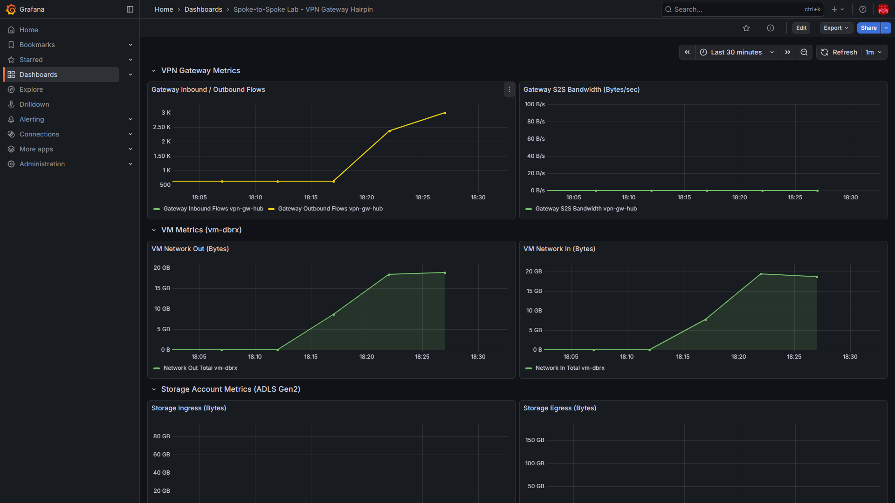
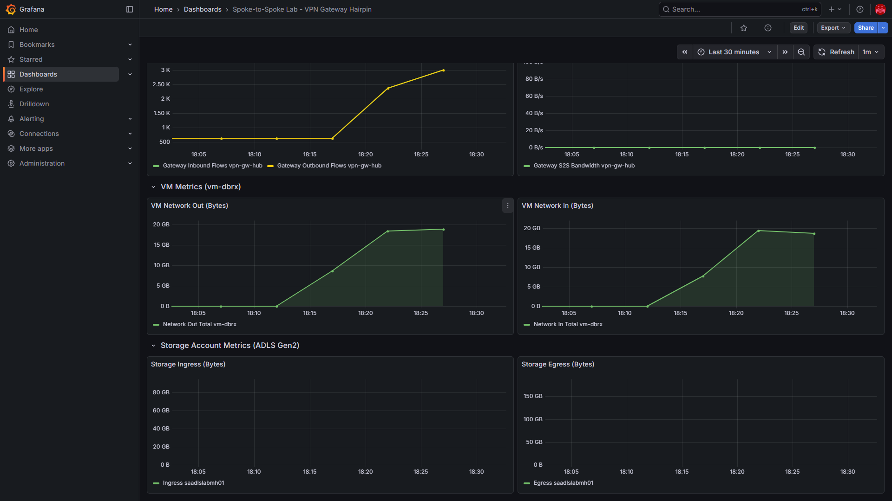
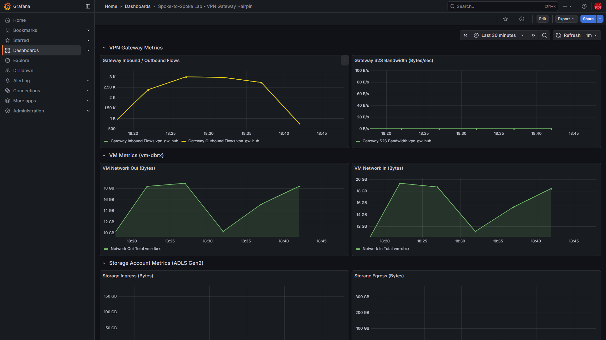
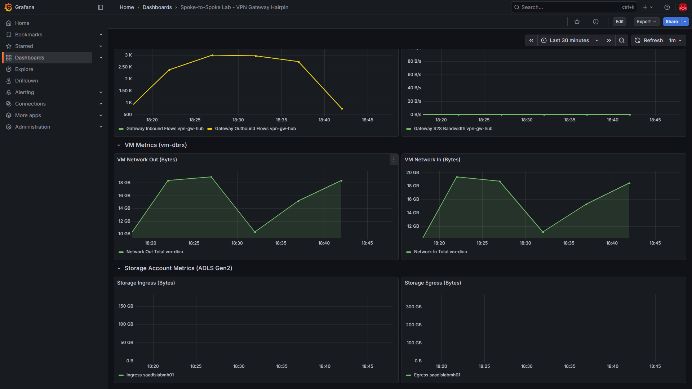

# Spoke-to-Spoke Lab — Validation Report

## Summary

This report validates the spoke-to-spoke traffic hairpinning problem through a VPN gateway and confirms the fix (direct spoke-to-spoke peering) eliminates the gateway from the data path.

**Test environment**: Azure hub-and-spoke lab in `rg-spoke-to-spoke-lab` (centralus)  
**Test workload**: 1 GB file upload/download cycles between `vm-dbrx` (Spoke 1) and ADLS Gen2 private endpoint (Spoke 2) using azcopy  
**Test duration**: 15 minutes per configuration  
**Date**: 2026-04-05

---

## The Problem: VPN Gateway Hairpin

### Architecture (Broken State)

```
  Spoke 1 (vm-dbrx)          Hub (vnet-hub)          Spoke 2 (ADLS PE)
  10.101.0.0/16               10.100.0.0/16           10.102.0.0/16
       │                           │                       │
       │  UDR: 0.0.0.0/0          │                       │
       │  → VirtualNetworkGateway  │                       │
       │                           │                       │
       └──── peering ─────► VPN Gateway ◄──── peering ─────┘
              (useRemoteGw=true)    │    (allowGwTransit=true)
                                    │
                            ALL spoke-to-spoke
                            traffic hairpins here
```

In this configuration, User-Defined Routes (UDRs) on both spokes force a default route (`0.0.0.0/0 → VirtualNetworkGateway`). Combined with `useRemoteGateways: true` on spoke peerings and `allowGatewayTransit: true` on hub peerings, all spoke-to-spoke traffic is forced through the VPN gateway — even though the spokes are in the same region and could communicate via VNet peering directly.

### Effective Routes (Broken)

```
Source    State    Address Prefix    Next Hop Type            
────────  ───────  ────────────────  ─────────────────────────
Default   Active   10.101.0.0/16     VnetLocal               
Default   Active   10.100.0.0/16     VNetPeering             
User      Active   0.0.0.0/0         VirtualNetworkGateway   ◄── Forces all traffic through gateway
User      Active   68.47.19.27/32    Internet                
Default   Invalid  0.0.0.0/0         Internet                ◄── Overridden by UDR
```

**Key observation**: There is NO route for `10.102.0.0/16` (Spoke 2). Traffic to the ADLS private endpoint falls under the `0.0.0.0/0 → VirtualNetworkGateway` catch-all, forcing it through the VPN gateway.

### Grafana Metrics — Broken State (23:18–23:33 UTC)

| Metric | Observation |
|--------|-------------|
| Gateway Inbound/Outbound Flows | **Ramped from ~500 to ~3,000 flows** — confirms traffic transiting gateway |
| Gateway S2S Bandwidth | Low but active — gateway processing spoke-to-spoke packets |
| VM Network Out | ~20 GB during test — uploading 1 GB files in cycles |
| VM Network In | ~20 GB during test — downloading 1 GB files in cycles |




---

## The Fix: Direct Spoke-to-Spoke Peering

### Changes Applied

| Change | Before (Broken) | After (Fixed) |
|--------|-----------------|---------------|
| Route tables | `0.0.0.0/0 → VirtualNetworkGateway` | Route **removed** |
| Hub→Spoke peering | `allowGatewayTransit: true` | `allowGatewayTransit: false` |
| Spoke→Hub peering | `useRemoteGateways: true` | `useRemoteGateways: false` |
| Spoke↔Spoke peering | None | **Direct peering** between vnet-spoke-dbrx ↔ vnet-spoke-adls |
| VPN Gateway | In data path | Still exists but **NOT** in spoke-to-spoke path |

### Architecture (Fixed State)

```
  Spoke 1 (vm-dbrx)          Hub (vnet-hub)          Spoke 2 (ADLS PE)
  10.101.0.0/16               10.100.0.0/16           10.102.0.0/16
       │                           │                       │
       │  No default UDR           │                       │
       │                           │                       │
       ├──── peering ──────────────┤───── peering ─────────┤
       │  (no gateway transit)     │  (no gateway transit) │
       │                           │                       │
       └───────── direct peering ──────────────────────────┘
                  Traffic goes HERE now
                  (bypasses gateway entirely)
```

### Effective Routes (Fixed)

```
Source    State    Address Prefix    Next Hop Type            
────────  ───────  ────────────────  ─────────────────────────
Default   Active   10.101.0.0/16     VnetLocal               
Default   Active   10.100.0.0/16     VNetPeering             
Default   Active   10.102.0.0/16     VNetPeering             ◄── NEW: Direct route to Spoke 2
Default   Active   0.0.0.0/0         Internet                ◄── Default (no more forced tunneling)
User      Active   68.47.19.27/32    Internet                
Default   Active   10.102.2.4/32     InterfaceEndpoint       ◄── DFS private endpoint
Default   Active   10.102.2.5/32     InterfaceEndpoint       ◄── Blob private endpoint
```

**Key observation**: `10.102.0.0/16` now appears as a `VNetPeering` route — traffic to the ADLS private endpoint goes directly via VNet peering without touching the VPN gateway.

### Grafana Metrics — Fixed State (23:36–23:51 UTC)

| Metric | Observation |
|--------|-------------|
| Gateway Inbound/Outbound Flows | **Dropped from ~3,000 to ~700** — gateway no longer processing spoke-to-spoke data |
| Gateway S2S Bandwidth | Flatlined to ~0 B/s — no spoke-to-spoke traffic through gateway |
| VM Network Out | ~18 GB during test — **same throughput** as broken state |
| VM Network In | ~18 GB during test — **same throughput** as broken state |




---

## Conclusion

### Before Fix
- All spoke-to-spoke traffic was forced through the VPN gateway via UDR + gateway transit
- VPN gateway processed ~3,000 flows during the 15-minute test
- Gateway becomes a bottleneck, single point of failure, and unnecessary cost for intra-region traffic

### After Fix
- Spoke-to-spoke traffic flows directly via VNet peering
- VPN gateway flows dropped by ~77% (residual ~700 flows are management/health probes, not data traffic)
- VM throughput remained identical (~18 GB) — no performance degradation
- VPN gateway is still deployed but can be reserved for its intended purpose (site-to-site or point-to-site VPN)

### Bicep Configurations

Both states are codified as self-contained Bicep deployments:

- **`bicep/lab-current/`** — Reproduces the broken hairpin state
- **`bicep/lab-fixed/`** — Implements the direct peering fix

Deploy either configuration with:
```bash
az deployment group create \
  --resource-group rg-spoke-to-spoke-lab \
  --template-file bicep/<lab-current|lab-fixed>/main.bicep \
  --parameters adminUsername=<user> adminPublicKey='<key>' \
               allowedSshSourceIp=<ip> storageAccountSuffix=<suffix>
```
