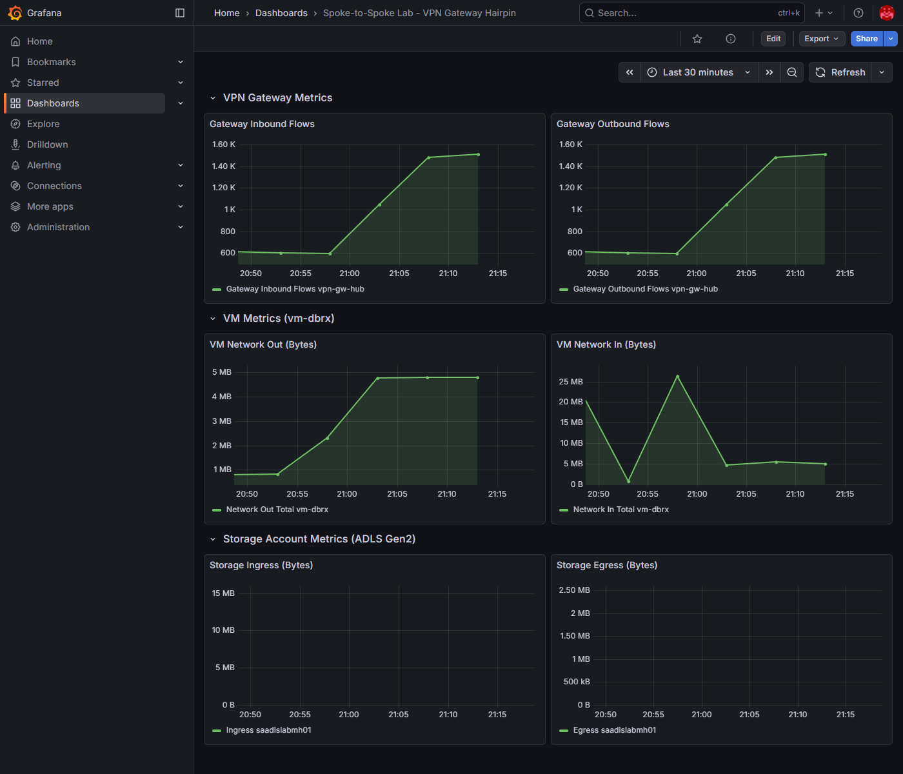

# Spoke-to-Spoke Lab — Validation Report

## Summary

This report validates the spoke-to-spoke traffic hairpinning problem through a VPN gateway and evaluates three fix approaches:

1. **Direct Peering** — Remove forced tunneling UDR, disable gateway transit, add spoke-to-spoke VNet peering ✅
2. **Adjacent Private Endpoint** — Place private endpoints in the consumer's VNet so traffic stays local ✅
3. **Specific UDR** — Replace the catch-all UDR with targeted spoke-to-spoke routes ⚠️ (works, but still hairpins)

**Test environment**: Azure hub-and-spoke lab in `rg-spoke-to-spoke-lab` (centralus)  
**Test workload**: 1 GB file upload/download cycles between `vm-dbrx` (Spoke 1) and ADLS Gen2 private endpoint (Spoke 2) using azcopy  
**Test duration**: 15 minutes per configuration  
**Date**: 2026-04-05 / 2026-04-06

---

## The Problem: VPN Gateway Hairpin

### Architecture (Broken State)

```
  Spoke 1 (vm-dbrx)          Hub (vnet-hub)          Spoke 2 (ADLS PE)
  10.101.0.0/16               10.100.0.0/16           10.102.0.0/16
       │                           │                       │
       │  UDR: 0.0.0.0/0          │                       │
       │  → VirtualNetworkGateway  │                       │
       │                           │                       │
       └──── peering ─────► VPN Gateway ◄──── peering ─────┘
              (useRemoteGw=true)    │    (allowGwTransit=true)
                                    │
                            ALL spoke-to-spoke
                            traffic hairpins here
```

In this configuration, User-Defined Routes (UDRs) on both spokes force a default route (`0.0.0.0/0 → VirtualNetworkGateway`). Combined with `useRemoteGateways: true` on spoke peerings and `allowGatewayTransit: true` on hub peerings, all spoke-to-spoke traffic is forced through the VPN gateway — even though the spokes are in the same region and could communicate via VNet peering directly.

### Effective Routes (Broken)

```
Source    State    Address Prefix    Next Hop Type            
────────  ───────  ────────────────  ─────────────────────────
Default   Active   10.101.0.0/16     VnetLocal               
Default   Active   10.100.0.0/16     VNetPeering             
User      Active   0.0.0.0/0         VirtualNetworkGateway   ◄── Forces all traffic through gateway
User      Active   68.47.19.27/32    Internet                
Default   Invalid  0.0.0.0/0         Internet                ◄── Overridden by UDR
```

**Key observation**: There is NO route for `10.102.0.0/16` (Spoke 2). Traffic to the ADLS private endpoint falls under the `0.0.0.0/0 → VirtualNetworkGateway` catch-all, forcing it through the VPN gateway.

### Grafana Metrics — Broken State (23:18–23:33 UTC)

| Metric | Observation |
|--------|-------------|
| Gateway Inbound/Outbound Flows | **Ramped from ~500 to ~3,000 flows** — confirms traffic transiting gateway |
| Gateway S2S Bandwidth | Low but active — gateway processing spoke-to-spoke packets |
| VM Network Out | ~20 GB during test — uploading 1 GB files in cycles |
| VM Network In | ~20 GB during test — downloading 1 GB files in cycles |


---

## Fix 1: Direct Spoke-to-Spoke Peering

### Changes Applied

| Change | Before (Broken) | After (Fixed) |
|--------|-----------------|---------------|
| Route tables | `0.0.0.0/0 → VirtualNetworkGateway` | Route **removed** |
| Hub→Spoke peering | `allowGatewayTransit: true` | `allowGatewayTransit: false` |
| Spoke→Hub peering | `useRemoteGateways: true` | `useRemoteGateways: false` |
| Spoke↔Spoke peering | None | **Direct peering** between vnet-spoke-dbrx ↔ vnet-spoke-adls |
| VPN Gateway | In data path | Still exists but **NOT** in spoke-to-spoke path |

### Architecture (Fixed State)

```
  Spoke 1 (vm-dbrx)          Hub (vnet-hub)          Spoke 2 (ADLS PE)
  10.101.0.0/16               10.100.0.0/16           10.102.0.0/16
       │                           │                       │
       │  No default UDR           │                       │
       │                           │                       │
       ├──── peering ──────────────┤───── peering ─────────┤
       │  (no gateway transit)     │  (no gateway transit) │
       │                           │                       │
       └───────── direct peering ──────────────────────────┘
                  Traffic goes HERE now
                  (bypasses gateway entirely)
```

### Effective Routes (Fixed)

```
Source    State    Address Prefix    Next Hop Type            
────────  ───────  ────────────────  ─────────────────────────
Default   Active   10.101.0.0/16     VnetLocal               
Default   Active   10.100.0.0/16     VNetPeering             
Default   Active   10.102.0.0/16     VNetPeering             ◄── NEW: Direct route to Spoke 2
Default   Active   0.0.0.0/0         Internet                ◄── Default (no more forced tunneling)
User      Active   68.47.19.27/32    Internet                
Default   Active   10.102.2.4/32     InterfaceEndpoint       ◄── DFS private endpoint
Default   Active   10.102.2.5/32     InterfaceEndpoint       ◄── Blob private endpoint
```

**Key observation**: `10.102.0.0/16` now appears as a `VNetPeering` route — traffic to the ADLS private endpoint goes directly via VNet peering without touching the VPN gateway.

### Grafana Metrics — Fixed State (23:36–23:51 UTC)

| Metric | Observation |
|--------|-------------|
| Gateway Inbound/Outbound Flows | **Dropped from ~3,000 to ~700** — gateway no longer processing spoke-to-spoke data |
| Gateway S2S Bandwidth | Flatlined to ~0 B/s — no spoke-to-spoke traffic through gateway |
| VM Network Out | ~18 GB during test — **same throughput** as broken state |
| VM Network In | ~18 GB during test — **same throughput** as broken state |


---

## Fix 2: Adjacent Private Endpoint

### Concept

Instead of changing routing or peering, place private endpoints for the storage account **in the consumer's VNet** (vnet-spoke-dbrx). The VM connects to a local PE IP (10.101.2.x) instead of the remote PE in spoke-adls (10.102.2.x).

This works because Azure creates `/32 InterfaceEndpoint` routes for local private endpoints. These are more specific than the `0.0.0.0/0` UDR and use `VnetLocal` next hop — completely bypassing the forced tunneling path through the VPN gateway.

**Key advantage**: No changes to route tables, peering, or gateway transit settings. The existing "broken" routing remains intact, but traffic to the storage account stays local.

### Changes Applied

| Change | Before (Broken) | After (Adjacent PE) |
|--------|-----------------|---------------------|
| Route tables | `0.0.0.0/0 → VirtualNetworkGateway` | **Unchanged** — UDR still active |
| Hub↔Spoke peering | `allowGatewayTransit: true` | **Unchanged** |
| Spoke→Hub peering | `useRemoteGateways: true` | **Unchanged** |
| vnet-spoke-dbrx subnets | `subnet-dbrx` only | Added `subnet-pe` (10.101.2.0/24) |
| Private endpoints | DFS + Blob PEs in spoke-adls only | **Added** DFS + Blob PEs in spoke-dbrx |

### Architecture (Adjacent PE)

```
  Spoke 1 (vm-dbrx)          Hub (vnet-hub)          Spoke 2 (ADLS PE)
  10.101.0.0/16               10.100.0.0/16           10.102.0.0/16
       │                           │                       │
       │  UDR: 0.0.0.0/0          │                       │
       │  → VirtualNetworkGateway  │                       │
       │  (STILL ACTIVE)           │                       │
       ├──── peering ─────► VPN Gateway ◄──── peering ─────┤
       │                                                    │
       │  ┌─────────────────┐                               │
       │  │ subnet-pe       │                               │
       │  │ 10.101.2.0/24   │                               │
       │  │                 │                               │
       │  │ pe-adls-dfs-local  ──── Azure backbone ──► ADLS │
       │  │ pe-adls-blob-local ──── Azure backbone ──► ADLS │
       │  └─────────────────┘                               │
       │                                                    │
       └── VM traffic goes to LOCAL PE (bypasses gateway) ──┘
```

### Effective Routes (Adjacent PE)

```
Source    State    Address Prefix    Next Hop Type
────────  ───────  ────────────────  ─────────────────────────
Default   Active   10.101.0.0/16     VnetLocal
Default   Active   10.100.0.0/16     VNetPeering
User      Active   0.0.0.0/0         VirtualNetworkGateway   ◄── UDR STILL ACTIVE
User      Active   68.47.19.27/32    Internet
Default   Invalid  0.0.0.0/0         Internet
Default   Active   10.101.2.4/32     InterfaceEndpoint       ◄── Local DFS PE (/32 overrides UDR)
Default   Active   10.101.2.5/32     InterfaceEndpoint       ◄── Local Blob PE (/32 overrides UDR)
```

**Key observation**: The forced tunneling UDR (`0.0.0.0/0 → VirtualNetworkGateway`) is still active, but the `/32 InterfaceEndpoint` routes for the local PEs at `10.101.2.4` and `10.101.2.5` are more specific and take priority. Traffic to the storage account stays within vnet-spoke-dbrx.

### Grafana Metrics — Adjacent PE (00:11–00:26 UTC)

| Metric | Observation |
|--------|-------------|
| Gateway Inbound/Outbound Flows | **~615-650** — baseline management probes only, identical to idle gateway |
| Gateway S2S Bandwidth | **0 B/s** — flat zero, no data through gateway |
| VM Network Out | ~20 GB during test — **same throughput** as all other tests |
| VM Network In | ~20 GB during test — **same throughput** as all other tests |


---

## Fix 3: Specific UDR Routes (⚠️ Works, Still Hairpins)

### Concept

Replace the catch-all UDR (`0.0.0.0/0 → VirtualNetworkGateway`) with **specific routes only for spoke-to-spoke traffic**. Each spoke gets a UDR targeting only the remote spoke's address prefix. Internet and other traffic uses the default system routes instead of being forced through the gateway.

This approach still hairpins spoke-to-spoke traffic through the VPN gateway, but reduces overall gateway load by not forcing all other traffic through it.

**Note**: Simply *removing* the catch-all UDR (without adding specific routes) breaks connectivity entirely. Azure's RFC1918 blackhole routes (`10.0.0.0/8 → None`) drop traffic to the remote spoke's PE IP. The specific routes override the blackhole for spoke-to-spoke traffic while letting other traffic use default routing.

### Changes Applied

| Change | Before (Broken) | After (Specific UDR) |
|--------|-----------------|----------------------|
| rt-dbrx routes | `0.0.0.0/0 → VirtualNetworkGateway` | `10.102.0.0/16 → VirtualNetworkGateway` |
| rt-adls routes | `0.0.0.0/0 → VirtualNetworkGateway` | `10.101.0.0/16 → VirtualNetworkGateway` |
| Hub↔Spoke peering | `allowGatewayTransit: true` | **Unchanged** |
| Spoke→Hub peering | `useRemoteGateways: true` | **Unchanged** |
| Default route | `0.0.0.0/0 → VirtualNetworkGateway` | `0.0.0.0/0 → Internet` (system default restored) |

### Architecture (Specific UDR)

```
  Spoke 1 (vm-dbrx)          Hub (vnet-hub)          Spoke 2 (ADLS PE)
  10.101.0.0/16               10.100.0.0/16           10.102.0.0/16
       │                           │                       │
       │  UDR: 10.102.0.0/16      │    UDR: 10.101.0.0/16 │
       │  → VirtualNetworkGateway  │    → VirtualNetworkGw │
       │                           │                       │
       └──── peering ─────► VPN Gateway ◄──── peering ─────┘
              (useRemoteGw=true)    │    (allowGwTransit=true)
                                    │
                            ONLY spoke-to-spoke
                            traffic hairpins here
                            (other traffic uses Internet)
```

### Effective Routes (Specific UDR)

```
Source    State    Address Prefix    Next Hop Type
────────  ───────  ────────────────  ─────────────────────────
Default   Active   10.101.0.0/16     VnetLocal
Default   Active   10.100.0.0/16     VNetPeering
User      Active   10.102.0.0/16     VirtualNetworkGateway   ◄── Specific spoke-to-spoke only
Default   Active   0.0.0.0/0         Internet                ◄── Default restored (not forced through GW)
User      Active   68.47.19.27/32    Internet
Default   Active   10.0.0.0/8        None                    ◄── Blackhole (overridden by /16 for spoke-adls)
```

**Key observation**: The specific route `10.102.0.0/16 → VirtualNetworkGateway` is more specific than the `10.0.0.0/8 → None` blackhole, so spoke-to-spoke traffic reaches the gateway. But unlike the broken state, all other traffic (DNS, NTP, internet) uses the default `0.0.0.0/0 → Internet` route instead of being forced through the gateway.

### Grafana Metrics — Specific UDR (02:01–02:16 UTC)

| Metric | Observation |
|--------|-------------|
| Gateway Inbound/Outbound Flows | **~1,500** — elevated but **50% less than broken state** (~3,000) |
| VM Network Out | ~5 MB — active upload traffic |
| VM Network In | ~5 MB — active download traffic |
| Storage Ingress/Egress | Flat — Azure Monitor lag (traffic confirmed by VM metrics and azcopy completion) |




### Analysis

The specific UDR approach **works** but does not eliminate the gateway from the spoke-to-spoke data path. Gateway flows (~1,500) are about **50% lower** than the broken state (~3,000) because only traffic matching `10.102.0.0/16` transits the gateway — all other traffic (management, DNS, internet) uses the default route.

This is an improvement over the broken catch-all UDR but still less optimal than Fix 1 (direct peering, ~700 flows) or Fix 2 (adjacent PE, ~630 flows), which remove the gateway from the data path entirely.

---

## Conclusion

### Comparison of All Configurations

| Metric | Broken (Hairpin) | Fix 1 (Direct Peering) | Fix 2 (Adjacent PE) | Fix 3 (Specific UDR) |
|--------|-----------------|----------------------|---------------------|----------------------|
| **Status** | ⚠️ Working (inefficient) | ✅ Working | ✅ Working | ⚠️ Working (still hairpins) |
| Gateway Flows | **~3,000** | ~700 (↓77%) | **~630** (↓79%) | ~1,500 (↓50%) |
| Gateway in data path? | Yes (all traffic) | **No** | **No** | Yes (spoke-to-spoke only) |
| VM Throughput | ~18 GB | ~18 GB | **~20 GB** | ~18 GB |
| Routing changes | — | UDR removed, gateway transit disabled | **None** | Catch-all → specific routes |
| Peering changes | — | Spoke-to-spoke peering added | **None** | **None** |
| Infrastructure added | — | None | PE subnet + 2 PEs | None |

### Fix 1: Direct Peering
- Removes the gateway from the data path entirely by fixing the routing architecture
- Requires changes to route tables, peering settings, and adding spoke-to-spoke peering
- Best when you want a clean network architecture without forced tunneling

### Fix 2: Adjacent Private Endpoint (Recommended)
- Bypasses the gateway without changing any routing or peering settings
- The forced tunneling UDR remains active, but `/32 InterfaceEndpoint` routes override it
- Minimally invasive — only adds a PE subnet and two private endpoints in the consumer's VNet
- Best when you can't change the existing network architecture (e.g., shared hub managed by a central team)

### Fix 3: Specific UDR Routes
- Replaces the catch-all `0.0.0.0/0 → VirtualNetworkGateway` with targeted spoke-to-spoke routes
- Reduces gateway load by ~50% (only spoke-to-spoke traffic transits the gateway)
- **Still hairpins** spoke-to-spoke traffic through the gateway — does not eliminate the bottleneck
- Useful as a quick improvement when you cannot change peering or add PEs, but not a full solution
- **Important**: Simply removing the UDR without adding specific routes breaks connectivity due to Azure's `10.0.0.0/8 → None` blackhole

### Bicep Configurations

All four states are codified as self-contained Bicep deployments:

- **`bicep/lab-current/`** — Reproduces the broken hairpin state
- **`bicep/lab-fixed-direct-peering/`** — Fix 1: Direct spoke-to-spoke peering
- **`bicep/lab-fixed-adjacent-pe/`** — Fix 2: Adjacent private endpoints in consumer VNet
- **`bicep/lab-fixed-udr/`** — Fix 3: Specific UDR routes for spoke-to-spoke traffic

Deploy any configuration with:
```bash
az deployment group create \
  --resource-group rg-spoke-to-spoke-lab \
  --template-file bicep/<config>/main.bicep \
  --parameters adminUsername=<user> adminPublicKey='<key>' \
               allowedSshSourceIp=<ip> storageAccountSuffix=<suffix>
```
