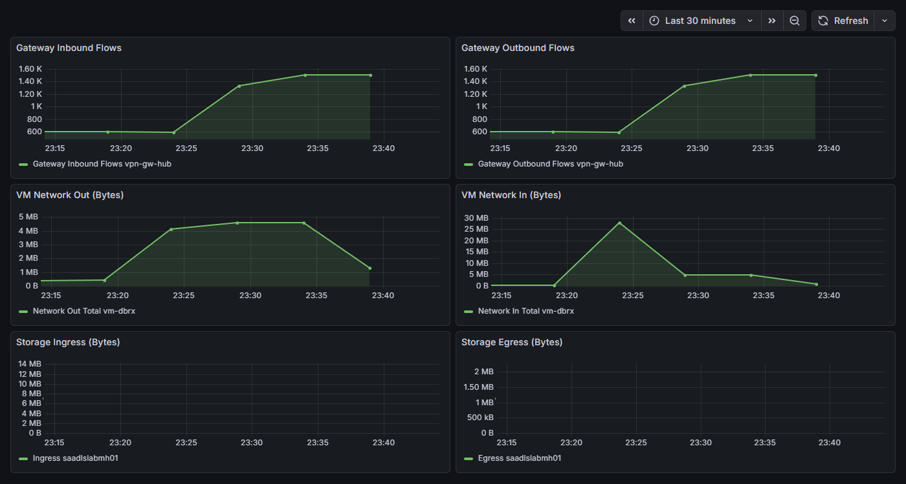
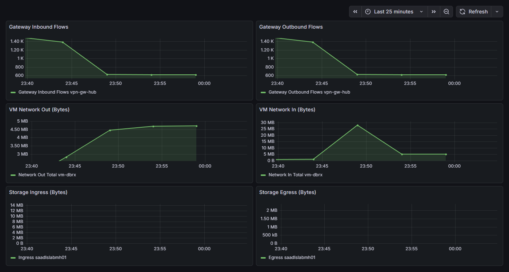
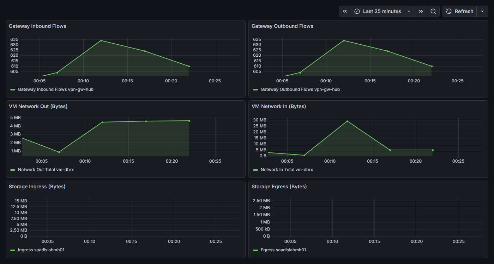
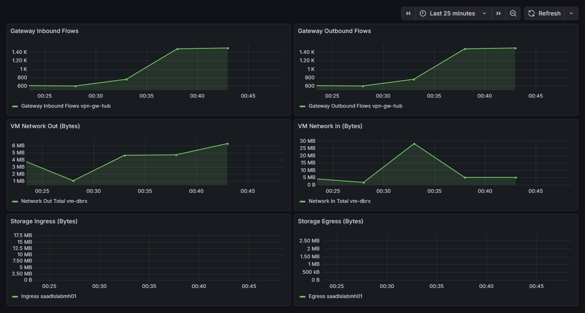

# Spoke-to-Spoke Lab — Validation Report

## Summary

This report validates the spoke-to-spoke traffic hairpinning problem through a VPN gateway and evaluates three fix approaches:

1. **Direct Peering** — Remove forced tunneling UDR, disable gateway transit, add spoke-to-spoke VNet peering ✅
2. **Adjacent Private Endpoint** — Place private endpoints in the consumer's VNet so traffic stays local ✅
3. **Specific UDR** — Replace the catch-all UDR with targeted spoke-to-spoke routes ⚠️ (works, but still hairpins)

**Test environment**: Azure hub-and-spoke lab in `rg-spoke-to-spoke-lab` (centralus)  
**Test workload**: 1 GB file upload/download cycles between `vm-dbrx` (Spoke 1) and ADLS Gen2 private endpoint (Spoke 2) using azcopy  
**Test duration**: 15 minutes per configuration  
**Date**: 2026-04-06

---

## The Problem: VPN Gateway Hairpin

### Architecture (Broken State)

```
  Spoke 1 (vm-dbrx)          Hub (vnet-hub)          Spoke 2 (ADLS PE)
  10.101.0.0/16               10.100.0.0/16           10.102.0.0/16
       │                           │                       │
       │  UDR: 0.0.0.0/0          │                       │
       │  → VirtualNetworkGateway  │                       │
       │                           │                       │
       └──── peering ─────► VPN Gateway ◄──── peering ─────┘
              (useRemoteGw=true)    │    (allowGwTransit=true)
                                    │
                            ALL spoke-to-spoke
                            traffic hairpins here
```

User-Defined Routes (UDRs) on both spokes force a default route (`0.0.0.0/0 → VirtualNetworkGateway`). Combined with `useRemoteGateways: true` on spoke peerings and `allowGatewayTransit: true` on hub peerings, **all** spoke-to-spoke traffic is forced through the VPN gateway — even though the spokes are in the same region.

### Effective Routes (Broken)

```
Source    State    Address Prefix    Next Hop Type
────────  ───────  ────────────────  ─────────────────────────
Default   Active   10.101.0.0/16     VnetLocal
Default   Active   10.100.0.0/16     VNetPeering
User      Active   0.0.0.0/0         VirtualNetworkGateway   ◄── Forces ALL traffic through gateway
User      Active   68.47.19.27/32    Internet
Default   Invalid  0.0.0.0/0         Internet                ◄── Overridden by UDR
```

**Key observation**: No route for `10.102.0.0/16` (Spoke 2). Traffic to the ADLS private endpoint (`10.102.2.4`) falls under the `0.0.0.0/0 → VirtualNetworkGateway` catch-all.

### Grafana — Broken State (04:22–04:37 UTC)

| Metric | Observation |
|--------|-------------|
| Gateway Inbound/Outbound Flows | Ramped from **~600 baseline to ~1,500** — traffic transiting gateway |
| VM Network Out | ~4.5 MB — uploading 1 GB files in cycles |
| VM Network In | Spike to ~25 MB, settling ~5 MB — download traffic |
| Storage Ingress/Egress | Flat (Azure Monitor hourly aggregation lag) |



---

## Fix 1: Direct Spoke-to-Spoke Peering

### Changes Applied

| Change | Before (Broken) | After (Direct Peering) |
|--------|-----------------|------------------------|
| Route tables | `0.0.0.0/0 → VirtualNetworkGateway` | Route **removed** |
| Hub→Spoke peering | `allowGatewayTransit: true` | `allowGatewayTransit: false` |
| Spoke→Hub peering | `useRemoteGateways: true` | `useRemoteGateways: false` |
| Spoke↔Spoke peering | None | **Direct peering** vnet-spoke-dbrx ↔ vnet-spoke-adls |

### Architecture (Direct Peering)

```
  Spoke 1 (vm-dbrx)          Hub (vnet-hub)          Spoke 2 (ADLS PE)
  10.101.0.0/16               10.100.0.0/16           10.102.0.0/16
       │                           │                       │
       │  No default UDR           │                       │
       │                           │                       │
       ├──── peering ──────────────┤───── peering ─────────┤
       │  (no gateway transit)     │  (no gateway transit) │
       │                                                   │
       └───────── direct peering ──────────────────────────┘
                  Traffic goes HERE now (bypasses gateway)
```

### Effective Routes (Direct Peering)

```
Source    State    Address Prefix    Next Hop Type
────────  ───────  ────────────────  ─────────────────────────
Default   Active   10.101.0.0/16     VnetLocal
Default   Active   10.100.0.0/16     VNetPeering
Default   Active   10.102.0.0/16     VNetPeering             ◄── Direct route to Spoke 2
Default   Active   0.0.0.0/0         Internet                ◄── Default (no forced tunneling)
User      Active   68.47.19.27/32    Internet
```

### Grafana — Direct Peering (04:47–05:03 UTC)

| Metric | Observation |
|--------|-------------|
| Gateway Inbound/Outbound Flows | **Dropped from ~1,400 to ~600 baseline** — gateway idle |
| VM Network Out | ~4.5 MB — same throughput as broken state |
| VM Network In | Spike to ~25 MB, settling ~5 MB |



---

## Fix 2: Adjacent Private Endpoint

### Concept

Place private endpoints for the storage account **in the consumer's VNet** (vnet-spoke-dbrx). The VM connects to a local PE IP (`10.101.2.x`) instead of the remote PE (`10.102.2.x`). Azure creates `/32 InterfaceEndpoint` routes that are more specific than the `0.0.0.0/0` UDR, completely bypassing the forced tunneling path.

**Key advantage**: No changes to route tables, peering, or gateway transit. The existing "broken" routing remains intact, but storage traffic stays local.

### Changes Applied

| Change | Before (Broken) | After (Adjacent PE) |
|--------|-----------------|---------------------|
| Route tables | `0.0.0.0/0 → VirtualNetworkGateway` | **Unchanged** |
| Hub↔Spoke peering | `allowGatewayTransit: true` | **Unchanged** |
| Spoke→Hub peering | `useRemoteGateways: true` | **Unchanged** |
| vnet-spoke-dbrx subnets | `subnet-dbrx` only | Added `subnet-pe` (10.101.2.0/24) |
| Private endpoints | DFS + Blob PEs in spoke-adls only | **Added** DFS + Blob PEs in spoke-dbrx |

### Architecture (Adjacent PE)

```
  Spoke 1 (vm-dbrx)          Hub (vnet-hub)          Spoke 2 (ADLS PE)
  10.101.0.0/16               10.100.0.0/16           10.102.0.0/16
       │                           │                       │
       │  UDR: 0.0.0.0/0          │                       │
       │  → VirtualNetworkGateway  │                       │
       │  (STILL ACTIVE)           │                       │
       ├──── peering ─────► VPN Gateway ◄──── peering ─────┤
       │                                                    │
       │  ┌─────────────────┐                               │
       │  │ subnet-pe       │                               │
       │  │ 10.101.2.0/24   │                               │
       │  │                 │                               │
       │  │ pe-adls-dfs-local  ──── Azure backbone ──► ADLS │
       │  │ pe-adls-blob-local ──── Azure backbone ──► ADLS │
       │  └─────────────────┘                               │
       │                                                    │
       └── VM traffic goes to LOCAL PE (bypasses gateway) ──┘
```

### Effective Routes (Adjacent PE)

```
Source    State    Address Prefix    Next Hop Type
────────  ───────  ────────────────  ─────────────────────────
Default   Active   10.101.0.0/16     VnetLocal
Default   Active   10.100.0.0/16     VNetPeering
User      Active   0.0.0.0/0         VirtualNetworkGateway   ◄── UDR STILL ACTIVE
User      Active   68.47.19.27/32    Internet
Default   Invalid  0.0.0.0/0         Internet
Default   Active   10.101.2.4/32     InterfaceEndpoint       ◄── Local DFS PE (/32 overrides UDR)
Default   Active   10.101.2.5/32     InterfaceEndpoint       ◄── Local Blob PE (/32 overrides UDR)
```

**Key observation**: The `/32 InterfaceEndpoint` routes at `10.101.2.4` and `10.101.2.5` override the catch-all UDR. Traffic to the storage account stays within vnet-spoke-dbrx.

### Grafana — Adjacent PE (05:10–05:25 UTC)

| Metric | Observation |
|--------|-------------|
| Gateway Inbound/Outbound Flows | **~610-635** — pure baseline, gateway completely idle |
| VM Network Out | ~4.5 MB — same throughput |
| VM Network In | Spike to ~25 MB, settling ~5 MB |



---

## Fix 3: Specific UDR Routes

### Concept

Replace the catch-all UDR (`0.0.0.0/0 → VirtualNetworkGateway`) with **specific routes only for spoke-to-spoke traffic**. Each spoke gets a UDR targeting only the remote spoke's address prefix. Internet and other traffic uses default system routes.

Traffic still hairpins through the gateway for spoke-to-spoke, but the gateway no longer processes all other traffic (DNS, NTP, management, internet).

**Important**: Simply *removing* the catch-all UDR without adding specific routes **breaks connectivity** — Azure's RFC1918 blackhole routes (`10.0.0.0/8 → None`) drop traffic to the remote spoke's PE IP.

### Changes Applied

| Change | Before (Broken) | After (Specific UDR) |
|--------|-----------------|----------------------|
| rt-dbrx routes | `0.0.0.0/0 → VirtualNetworkGateway` | `10.102.0.0/16 → VirtualNetworkGateway` |
| rt-adls routes | `0.0.0.0/0 → VirtualNetworkGateway` | `10.101.0.0/16 → VirtualNetworkGateway` |
| Hub↔Spoke peering | `allowGatewayTransit: true` | **Unchanged** |
| Spoke→Hub peering | `useRemoteGateways: true` | **Unchanged** |
| Default route | Overridden by UDR | `0.0.0.0/0 → Internet` (system default restored) |

### Architecture (Specific UDR)

```
  Spoke 1 (vm-dbrx)          Hub (vnet-hub)          Spoke 2 (ADLS PE)
  10.101.0.0/16               10.100.0.0/16           10.102.0.0/16
       │                           │                       │
       │  UDR: 10.102.0.0/16      │    UDR: 10.101.0.0/16 │
       │  → VirtualNetworkGateway  │    → VirtualNetworkGw │
       │                           │                       │
       └──── peering ─────► VPN Gateway ◄──── peering ─────┘
              (useRemoteGw=true)    │    (allowGwTransit=true)
                                    │
                            ONLY spoke-to-spoke
                            traffic hairpins here
                            (other traffic uses Internet default)
```

### Effective Routes (Specific UDR)

```
Source    State    Address Prefix    Next Hop Type
────────  ───────  ────────────────  ─────────────────────────
Default   Active   10.101.0.0/16     VnetLocal
Default   Active   10.100.0.0/16     VNetPeering
User      Active   10.102.0.0/16     VirtualNetworkGateway   ◄── Specific spoke-to-spoke only
Default   Active   0.0.0.0/0         Internet                ◄── Default restored
User      Active   68.47.19.27/32    Internet
Default   Active   10.0.0.0/8        None                    ◄── Overridden by /16 for spoke-adls
```

**Key observation**: The `/16` route overrides the `10.0.0.0/8 → None` blackhole for spoke-to-spoke traffic, while other traffic uses the default `0.0.0.0/0 → Internet` route instead of being forced through the gateway.

### Grafana — Specific UDR (05:31–05:46 UTC)

| Metric | Observation |
|--------|-------------|
| Gateway Inbound/Outbound Flows | Ramped from **~600 to ~1,400** — spoke-to-spoke still transits gateway |
| VM Network Out | ~5.5 MB — same throughput |
| VM Network In | Spike to ~25 MB, settling ~5 MB |



---

## Conclusion

### Comparison of All Configurations

| Metric | Broken (Hairpin) | Fix 1 (Direct Peering) | Fix 2 (Adjacent PE) | Fix 3 (Specific UDR) |
|--------|-----------------|----------------------|---------------------|----------------------|
| **Status** | ⚠️ Working (inefficient) | ✅ Working | ✅ Working | ⚠️ Working (still hairpins) |
| Gateway Flows | **~1,500** | ~600 (baseline) | **~610** (baseline) | ~1,400 |
| Gateway in data path? | Yes (all traffic) | **No** | **No** | Yes (spoke-to-spoke only) |
| VM Throughput | ~4.5 MB/interval | ~4.5 MB/interval | ~4.5 MB/interval | ~5.5 MB/interval |
| Routing changes | — | UDR removed, gateway transit disabled | **None** | Catch-all → specific routes |
| Peering changes | — | Spoke-to-spoke peering added | **None** | **None** |
| Infrastructure added | — | None | PE subnet + 2 PEs | None |

### Fix 1: Direct Peering
- Removes the gateway from the data path entirely by fixing the routing architecture
- Requires changes to route tables, peering settings, and adding spoke-to-spoke peering
- Best when you want a clean network architecture without forced tunneling

### Fix 2: Adjacent Private Endpoint (Recommended)
- Bypasses the gateway without changing any routing or peering settings
- The forced tunneling UDR remains active, but `/32 InterfaceEndpoint` routes override it
- Minimally invasive — only adds a PE subnet and two private endpoints in the consumer's VNet
- Best when you can't change the existing network architecture (e.g., shared hub managed by a central team)

### Fix 3: Specific UDR Routes
- Replaces the catch-all `0.0.0.0/0 → VirtualNetworkGateway` with targeted spoke-to-spoke routes
- Gateway still processes spoke-to-spoke traffic but not other traffic (DNS, internet, management)
- **Still hairpins** — does not eliminate the gateway bottleneck for spoke-to-spoke
- Useful as a quick improvement when you cannot change peering or add PEs
- **Caution**: Simply removing the UDR without adding specific routes breaks connectivity due to `10.0.0.0/8 → None` blackhole

### Bicep Configurations

All four states are codified as self-contained Bicep deployments:

- **`bicep/lab-current/`** — Reproduces the broken hairpin state
- **`bicep/lab-fixed-direct-peering/`** — Fix 1: Direct spoke-to-spoke peering
- **`bicep/lab-fixed-adjacent-pe/`** — Fix 2: Adjacent private endpoints in consumer VNet
- **`bicep/lab-fixed-udr/`** — Fix 3: Specific UDR routes for spoke-to-spoke traffic

Deploy any configuration with:
```bash
az deployment group create \
  --resource-group rg-spoke-to-spoke-lab \
  --template-file bicep/<config>/main.bicep \
  --parameters adminUsername=<user> adminPublicKey='<key>' \
               allowedSshSourceIp=<ip> storageAccountSuffix=<suffix>
```
