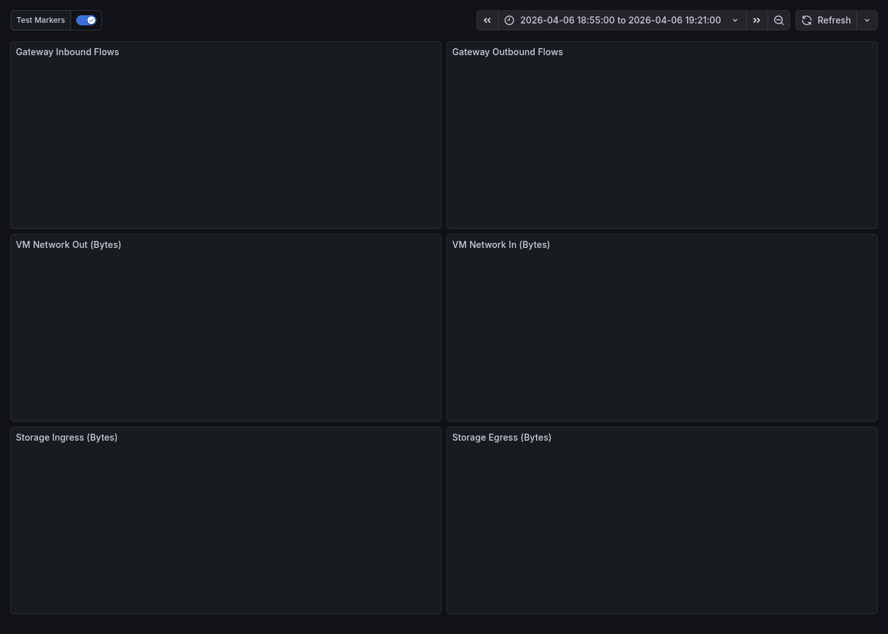

# Spoke-to-Spoke Lab — Validation Report

## Summary

This report validates the spoke-to-spoke traffic hairpinning problem through a VPN gateway and evaluates two fix approaches:

1. **Direct Peering** — Remove forced tunneling UDR, disable gateway transit, peer DBX spoke directly to PE spoke ✅ *(matches real-world fix)*
2. **Adjacent Private Endpoint** — Place private endpoints in the consumer's VNet so traffic stays local ✅

**Test environment**: Azure hub-and-spoke lab with dedicated PE VNet in `rg-spoke-to-spoke-lab` (centralus)  
**Test workload**: 1 GB file upload/download cycles between `vm-dbrx` (DBX spoke) and ADLS Gen2 private endpoint (PE spoke) using azcopy  
**Test duration**: 15 minutes per configuration, 5-minute gaps between tests  
**Date**: 2026-04-06 (all times CDT)

---

## Dashboard Overview — All Three Test Runs

The screenshot below shows the complete Grafana dashboard across all three test configurations in a single view. Each vertical dashed line is a **Grafana annotation** marking a test boundary (begin or end), posted programmatically via the Grafana API using `scripts/grafana-annotate.ps1`. The annotations create clear visual markers that correlate events across all six panels simultaneously.

Reading left to right, the three traffic bursts correspond to:

1. **Broken state** (~18:14–18:29 UTC) — Gateway flows spike to ~3K, all traffic hairpins
2. **Direct Peering** (~18:38–18:54 UTC) — Gateway flat at baseline, traffic flows peer-to-peer
3. **Adjacent PE** (~19:00–19:16 UTC) — Gateway remains flat, storage data stays in consumer spoke

Each panel includes **min, max, and mean** values in the legend table for quantitative comparison. The gateway panels use a **fixed Y-axis (0–3,500)** so the flat baseline in Fix 2 is visually distinct from the broken state's spike — without fixed scaling, auto-scale would make the ~600 ancillary flows appear as volatile spikes.


The following sections break down each configuration in detail.

---

## The Problem: VPN Gateway Hairpin

> **Note on gateway type**: This lab uses a VPN gateway (VpnGw1), but the same hairpin behavior occurs with an **ExpressRoute gateway**. Both gateway types support `allowGatewayTransit` / `useRemoteGateways` on VNet peerings, and both will process spoke-to-spoke traffic when a catch-all UDR forces `0.0.0.0/0 → VirtualNetworkGateway`. The fixes demonstrated here — direct peering and adjacent private endpoints — apply equally to ExpressRoute environments.

### Real-World Scenario

In the customer environment that motivated this lab, the topology includes a **dedicated Private Endpoint VNet** — a separate spoke that hosts all private endpoints centrally, rather than co-locating PEs within each service's spoke. The Databricks workloads in their own spoke(s) access ADLS Gen2 through PEs in this dedicated VNet:

```
  Databricks Spoke(s)          Hub                  PE VNet            ADLS
  ┌──────────────┐       ┌────────────┐       ┌────────────┐     ┌──────────┐
  │  DBX VMs     │       │  ER/VPN    │       │  PE (DFS)  │     │  Storage │
  │              │──────►│  Gateway   │──────►│  PE (Blob) │────►│  Account │
  │              │       │            │       │            │     │          │
  └──────────────┘       └────────────┘       └────────────┘     └──────────┘
        peering ──► Gateway Transit ──► peering
                    ALL traffic hairpins
```

The fix applied was **direct VNet peering between the Databricks spokes and the PE VNet**, eliminating the gateway from the data path. This maps directly to **Fix 1 (Direct Peering)** in this lab.

### Lab Architecture

This lab reproduces the customer's three-VNet topology:

- **Spoke 1** (`vnet-spoke-dbrx`, 10.101.0.0/16) — Databricks simulation with Linux VM
- **Hub** (`vnet-hub`, 10.100.0.0/16) — VPN Gateway in GatewaySubnet
- **PE Spoke** (`vnet-spoke-pe`, 10.103.0.0/16) — Dedicated PE VNet with DFS and Blob private endpoints
- **ADLS Spoke** (`vnet-spoke-adls`, 10.102.0.0/16) — Storage account (no PEs in this VNet)

### Architecture (Broken State)

```
  Spoke 1 (vm-dbrx)       Hub (vnet-hub)       PE Spoke              ADLS Spoke
  10.101.0.0/16            10.100.0.0/16        10.103.0.0/16         10.102.0.0/16
       │                        │                    │                     │
       │  UDR: 0/0 → GW        │                    │  PE (DFS)           │  Storage
       │                        │                    │  PE (Blob)          │  Account
       │                        │                    │                     │
       └── peering ────► VPN Gateway ◄── peering ────┘                    │
            (useRemoteGw)   │        (useRemoteGw)                        │
                            │                                             │
                    ALL spoke-to-spoke          peering ──────────────────┘
                    traffic hairpins here       (useRemoteGw)
```

All three spokes peer to the hub with gateway transit. UDRs on all spokes force `0.0.0.0/0 → VirtualNetworkGateway`. Traffic from vm-dbrx to the PE VNet (10.103.2.x) is caught by the UDR and hairpins through the VPN gateway.

### Effective Routes (Broken)

```
Source    State    Address Prefix    Next Hop Type
────────  ───────  ────────────────  ─────────────────────────
Default   Active   10.101.0.0/16     VnetLocal
Default   Active   10.100.0.0/16     VNetPeering
User      Active   0.0.0.0/0         VirtualNetworkGateway   ◄── Forces ALL traffic through gateway
User      Active   68.47.19.27/32    Internet
Default   Invalid  0.0.0.0/0         Internet                ◄── Overridden by UDR
```

**Key observation**: No explicit routes for `10.102.0.0/16` (ADLS spoke) or `10.103.0.0/16` (PE spoke). Traffic to the PE VNet private endpoints (`10.103.2.4`) falls under the `0.0.0.0/0 → VirtualNetworkGateway` catch-all, hairpinning through the gateway.

### Grafana — Broken State (13:14–13:29 CDT)

| Metric | Min | Max | Mean |
|--------|-----|-----|------|
| Gateway Inbound Flows | 607 | 2,956 | 1,821 |
| Gateway Outbound Flows | 607 | 2,956 | 1,821 |
| VM Network Out | 86 kB | 4.7 GB | 3.6 GB |
| VM Network In | 44 kB | 5.4 GB | 3.6 GB |

Gateway flows ramped from **607 to 2,956** — all storage traffic hairpins through the VPN gateway.


---

## Fix 1: Direct Spoke-to-Spoke Peering

### Changes Applied

| Change | Before (Broken) | After (Direct Peering) |
|--------|-----------------|------------------------|
| Route tables | `0.0.0.0/0 → VirtualNetworkGateway` | Route **removed** |
| Hub→Spoke peering | `allowGatewayTransit: true` | `allowGatewayTransit: false` |
| Spoke→Hub peering | `useRemoteGateways: true` | `useRemoteGateways: false` |
| Spoke↔PE peering | None | **Direct peering** vnet-spoke-dbrx ↔ vnet-spoke-pe |

### Architecture (Direct Peering)

```
  Spoke 1 (vm-dbrx)       Hub (vnet-hub)       PE Spoke              ADLS Spoke
  10.101.0.0/16            10.100.0.0/16        10.103.0.0/16         10.102.0.0/16
       │                        │                    │                     │
       │  No default UDR        │                    │  PE (DFS)           │
       │                        │                    │  PE (Blob)          │
       ├── peering ─────────────┤── peering ─────────┤                    │
       │  (no gateway transit)  │  (no gw transit)   │                    │
       │                                             │                    │
       └───────── direct peering ────────────────────┘                    │
                  Traffic goes HERE now                peering ───────────┘
                  (bypasses gateway)                   (no gw transit)
```

### Effective Routes (Direct Peering)

```
Source    State    Address Prefix    Next Hop Type
────────  ───────  ────────────────  ─────────────────────────
Default   Active   10.101.0.0/16     VnetLocal
Default   Active   10.100.0.0/16     VNetPeering
Default   Active   10.103.0.0/16     VNetPeering             ◄── Direct route to PE spoke
Default   Active   0.0.0.0/0         Internet                ◄── Default (no forced tunneling)
User      Active   68.47.19.27/32    Internet
Default   Active   10.103.2.4/32     InterfaceEndpoint       ◄── PE routes via peering
Default   Active   10.103.2.5/32     InterfaceEndpoint
```

### Grafana — Direct Peering (13:38–13:54 CDT)

| Metric | Min | Max | Mean |
|--------|-----|-----|------|
| Gateway Inbound Flows | 595 | 627 | 613 |
| Gateway Outbound Flows | 595 | 627 | 613 |
| VM Network Out | 116 kB | 5.0 GB | 3.6 GB |
| VM Network In | 58 kB | 5.4 GB | 3.6 GB |

Gateway flows **flat at ~600** (baseline) throughout the test. No spike — traffic flows directly via the DBX↔PE peering, completely bypassing the gateway.


---

## Fix 2: Adjacent Private Endpoint

### Concept

Place private endpoints for the storage account **in the consumer's VNet** (vnet-spoke-dbrx). The VM connects to a local PE IP (`10.101.2.x`) instead of the remote PE in the PE spoke (`10.103.2.x`). Azure creates `/32 InterfaceEndpoint` routes that are more specific than the `0.0.0.0/0` UDR, completely bypassing the forced tunneling path for storage data.

**Key advantage**: No changes to route tables, peering, or gateway transit. The existing "broken" routing remains intact, but storage traffic stays local.

**Note**: The catch-all UDR (`0.0.0.0/0 → VirtualNetworkGateway`) remains active, so ancillary traffic (AAD authentication, DNS, etc.) still transits the gateway. Only storage data is redirected via the `/32` routes.

### Changes Applied

| Change | Before (Broken) | After (Adjacent PE) |
|--------|-----------------|---------------------|
| Route tables | `0.0.0.0/0 → VirtualNetworkGateway` | **Unchanged** |
| Hub↔Spoke peering | `allowGatewayTransit: true` | **Unchanged** |
| Spoke→Hub peering | `useRemoteGateways: true` | **Unchanged** |
| vnet-spoke-dbrx subnets | `subnet-dbrx` only | Added `subnet-pe` (10.101.2.0/24) |
| Private endpoints | DFS + Blob PEs in PE spoke only | **Added** DFS + Blob PEs in spoke-dbrx |

### Architecture (Adjacent PE)

```
  Spoke 1 (vm-dbrx)       Hub (vnet-hub)       PE Spoke              ADLS Spoke
  10.101.0.0/16            10.100.0.0/16        10.103.0.0/16         10.102.0.0/16
       │                        │                    │                     │
       │  UDR: 0/0 → GW        │                    │  PE (DFS)           │  Storage
       │  (STILL ACTIVE)        │                    │  PE (Blob)          │  Account
       │                        │                    │                     │
       ├── peering ────► VPN Gateway ◄── peering ────┘                    │
       │                                              peering ────────────┘
       │  ┌─────────────────┐
       │  │ subnet-pe       │
       │  │ 10.101.2.0/24   │
       │  │ pe-dfs-local  ───── Azure backbone ───────────► ADLS
       │  │ pe-blob-local ───── Azure backbone ───────────► ADLS
       │  └─────────────────┘
       │
       └── VM traffic goes to LOCAL PE (bypasses gateway + PE spoke)
```

### Effective Routes (Adjacent PE)

```
Source    State    Address Prefix    Next Hop Type
────────  ───────  ────────────────  ─────────────────────────
Default   Active   10.101.0.0/16     VnetLocal
Default   Active   10.100.0.0/16     VNetPeering
User      Active   0.0.0.0/0         VirtualNetworkGateway   ◄── UDR STILL ACTIVE
User      Active   68.47.19.27/32    Internet
Default   Invalid  0.0.0.0/0         Internet
Default   Active   10.101.2.4/32     InterfaceEndpoint       ◄── Local DFS PE (/32 overrides UDR)
Default   Active   10.101.2.5/32     InterfaceEndpoint       ◄── Local Blob PE (/32 overrides UDR)
```

**Key observation**: The `/32 InterfaceEndpoint` routes at `10.101.2.4` and `10.101.2.5` override the catch-all UDR. Storage traffic stays within vnet-spoke-dbrx.

### Grafana — Adjacent PE (14:00–14:16 CDT)

| Metric | Min | Max | Mean |
|--------|-----|-----|------|
| Gateway Inbound Flows | 610 | 641 | 627 |
| Gateway Outbound Flows | 610 | 641 | 627 |
| VM Network Out | 84 kB | 5.1 GB | 3.6 GB |
| VM Network In | 43 kB | 5.4 GB | 3.6 GB |

Gateway flows remained **essentially flat at 610–641** — the gateway is not processing storage data. The slight variation (~30 flow range) is ancillary traffic (AAD auth, DNS queries) still caught by the catch-all UDR.



---

## Conclusion

### Comparison of All Configurations

| Metric | Broken (Hairpin) | Fix 1 (Direct Peering) | Fix 2 (Adjacent PE) |
|--------|-----------------|----------------------|---------------------|
| **Status** | ⚠️ Working (inefficient) | ✅ Working | ✅ Working |
| Gateway Flows (Max) | **2,956** | 627 (baseline) | **641** (flat baseline) |
| Gateway in data path? | Yes (all traffic) | **No** | **No** (storage data bypassed) |
| VM Network Out (Max) | 4.7 GB | 5.0 GB | 5.1 GB |
| VM Network In (Max) | 5.4 GB | 5.4 GB | 5.4 GB |
| Routing changes | — | UDR removed, gateway transit disabled | **None** |
| Peering changes | — | DBX↔PE spoke direct peering added | **None** |
| Infrastructure added | — | None | PE subnet + 2 PEs |

### Fix 1: Direct Peering (Recommended)
- **Matches the real-world customer fix** — the Databricks team peered their spoke directly to the PE spoke
- Removes the gateway from the data path entirely by fixing the routing architecture
- Requires changes to route tables, peering settings, and adding spoke-to-spoke peering
- Best for clean network architecture and when spoke-to-spoke direct communication is feasible

### Fix 2: Adjacent Private Endpoint
- Bypasses the gateway without changing any routing or peering settings
- The forced tunneling UDR remains active, but `/32 InterfaceEndpoint` routes override it
- Minimally invasive — only adds a PE subnet and two private endpoints in the consumer's VNet
- Valid alternative when direct peering between spokes isn't feasible or when preserving all non-PE traffic inspection is required
- **Note**: Ancillary traffic (AAD auth, DNS, etc.) still transits the gateway due to the catch-all UDR — only storage data is bypassed

### Other Approaches (Not Tested)

**Azure Virtual WAN (VWAN)** would also address this issue. VWAN's hub provides native spoke-to-spoke routing without requiring manual peering or UDRs — the VWAN hub router automatically learns spoke prefixes and forwards traffic directly between spokes. In a VWAN topology, spoke-to-spoke traffic does not hairpin through the VPN or ExpressRoute gateway; it is routed through the VWAN hub router at no additional gateway cost. VWAN also supports routing intent and policies that provide more granular control over inter-spoke traffic flows. However, VWAN requires migrating from a traditional hub-and-spoke architecture and was not tested in this lab.

### Security and Compliance Implications

Each fix has different security posture trade-offs. Organizations subject to regulatory controls (e.g., PCI-DSS, HIPAA, FedRAMP) should evaluate these carefully.

#### Broken State (Baseline)
- **Forced tunneling**: All traffic (`0.0.0.0/0`) routes through the gateway, providing a **central inspection point** — this is often a compliance requirement for environments mandating egress filtering or network-level DLP
- **Gateway as chokepoint**: The gateway sees all flows, enabling logging, IDS/IPS integration, and traffic analytics
- **Risk**: Gateway saturation degrades availability — PPS and throughput limits can cause packet drops, impacting SLA compliance

#### Fix 1: Direct Peering
- **Removes forced tunneling entirely** — spoke-to-spoke and internet traffic no longer transits the gateway
- **No central inspection point**: Traffic between spokes bypasses the hub completely. If your compliance framework requires all inter-VNet traffic to pass through a firewall or NVA for inspection, this fix **violates that requirement**
- **Mitigation**: Deploy an Azure Firewall or NVA in the hub and route spoke-to-spoke traffic through it instead of the gateway. This was not implemented in this lab.
- **NSG enforcement**: Without forced tunneling, NSGs on spoke subnets become the primary network-level control — ensure they are configured to restrict lateral movement between spokes
- **Private endpoint security**: Data still flows over private endpoints (no public internet exposure), maintaining data-in-transit confidentiality

#### Fix 2: Adjacent Private Endpoint
- **Preserves forced tunneling** — the catch-all UDR remains active, maintaining the central inspection/logging posture for all non-PE traffic
- **Storage data bypasses the gateway** via `/32 InterfaceEndpoint` routes, but stays entirely within the Azure backbone (PE-to-PE, never touches the internet)
- **Ancillary traffic still inspected**: AAD auth, DNS, management traffic continues through the gateway — compliance logging for authentication flows is maintained
- **Private Link compliance**: Data plane traffic uses Azure Private Link, which satisfies most data-sovereignty and data-in-transit requirements (encrypted within Azure backbone)
- **Additional PE surface area**: Two new private endpoints in the consumer VNet mean additional resources to govern — ensure PE approval workflows, DNS zone policies, and RBAC are applied consistently
- **Best compliance fit**: For environments requiring forced tunneling for audit/inspection purposes, adjacent PE is the **least disruptive** fix because it preserves the existing network security architecture

#### Summary

| Concern | Broken | Fix 1 (Direct Peering) | Fix 2 (Adjacent PE) |
|---------|--------|----------------------|---------------------|
| Forced tunneling preserved | ✅ Yes | ❌ **Removed** | ✅ Yes |
| Central inspection point | ✅ Gateway sees all traffic | ❌ Gateway bypassed | ⚠️ Gateway sees ancillary traffic |
| Data stays on private network | ✅ PE traffic | ✅ PE traffic | ✅ PE traffic |
| Gateway saturation risk | ⚠️ **High** | ✅ None | ✅ None (storage data bypassed) |
| NSG as primary control | ⚠️ UDR overrides | ✅ Required | ⚠️ UDR still active |
| Compliance change required | — | ⚠️ May violate forced tunneling mandate | ✅ Minimal |

### Bicep Configurations

All three states are codified as self-contained Bicep deployments:

- **`bicep/lab-current/`** — Reproduces the broken hairpin state
- **`bicep/lab-fixed-direct-peering/`** — Fix 1: Direct spoke-to-spoke peering
- **`bicep/lab-fixed-adjacent-pe/`** — Fix 2: Adjacent private endpoints in consumer VNet

Deploy any configuration with:
```bash
az deployment group create \
  --resource-group rg-spoke-to-spoke-lab \
  --template-file bicep/<config>/main.bicep \
  --parameters adminUsername=<user> adminPublicKey='<key>' \
               allowedSshSourceIp=<ip> storageAccountSuffix=<suffix>
```
